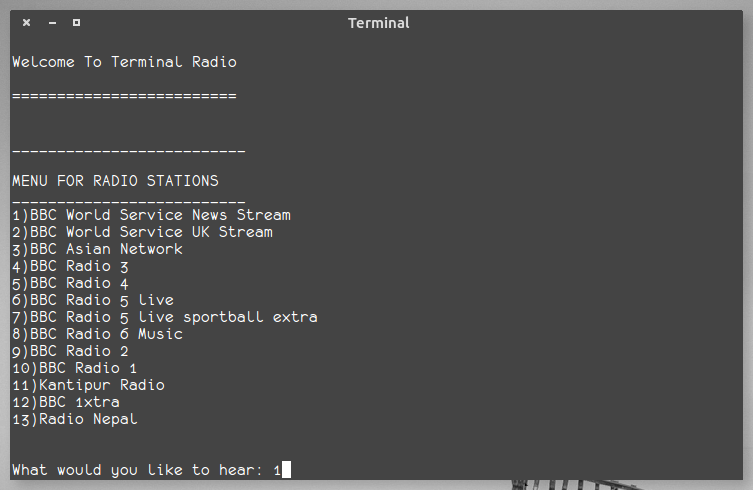

# terminal-radio

Info
====================
	terminal-radio lets you listen to your favorite radio station from terminal
	itself,  choose the station you'd like to listen to and you're good to go
	
Requirements
====================
	mplayer and bash

Usage
====================
	./tradio or sh  tradio

